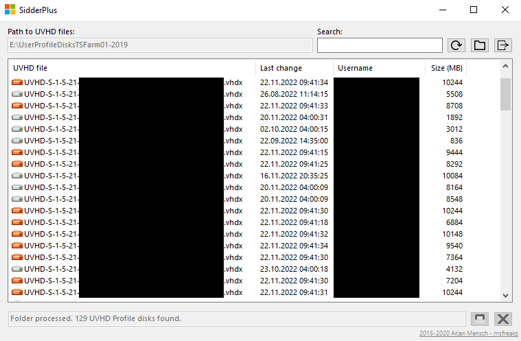
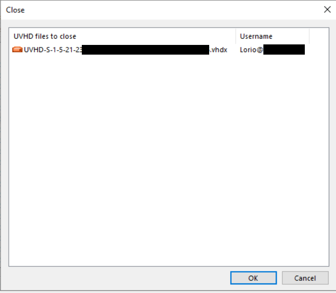
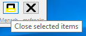

# SidderPlus

SidderPlus is a fork of [Sidder](https://github.com/msfreaks/Sidder) from [msfreaks](https://github.com/msfreaks/). The tool now runs with the .net4.8 framework.

Sidder allows to quickly identify which User Profile Disk belongs to which Domain User. 

This fork also allows to close an open smb file / close an locked UPD (User Profile Disk).

## Why SidderPlus
Sometimes we have the problem that users do not get their own user profile disk assigned. Therefore, you must search for the locked vhdx file name in Sidder and then go to Computer Management and close the open smb file. This fork adds this feature directly to Sidder.

Since I want the project to be found on GitHub and GitHub search usually excludes forks I renamed the project. The original project Sidder is [no longer maintained](https://msfreaks.wordpress.com/2020/02/17/sidder-v2-6-open-sourced-and-more/).

## Disclaimer
I am not a C# developer. I just "hacked" this version together. Before this project I had no idea how a C# project is organized. But now it works. Since the state of the project serves my purposes, there is no further roadmap. If you want changes, feel free to open an issue or PR. I will definitely take a look at it.

## Screenshot

## Download
You can download the latest version [here from the releases](https://github.com/MarkusDick/SidderPlus/releases/).

## Usage
You need to start Sidder as an administrator. Then you can select an item and press the left button to close the open SMB file / the locked UPD.

That's it.

## Thanks
Thanks to [msfreaks](https://github.com/msfreaks/) for creating and open sourcing this tool.

## License
### Sidder:
You are free to use the code to build your own Sidder or modify the existing Sidder to your liking, as long as the About box remains intact.

### SidderPlus:
My changes are under the MIT-License.